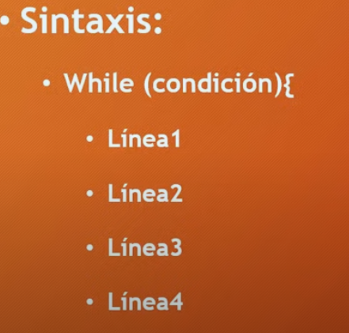
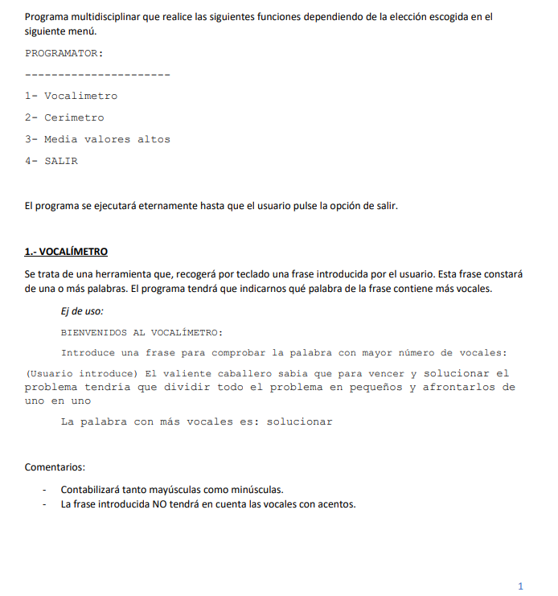

# Chuleta para practicar programación:

# Manipulación de cadenas de texto: clase Strings
- Los Strings están guardados en posiciones, por tanto siempre que quiera utilizar la longitud del String le tengo que restar -1. PE: "Juan" tiene 4 letras pero su posición empieza desde 0, no desde 1, esto quiere decir que la posición de la última letra de Juan es 3.

- Los espacios en blanco cuentan como caracter, es decir que cuentan su posición. PE: "Juan Pablo" tiene 9 posiciones(10-1), y 10 letras, ya que " " cuenta como caracter.

# Chuleta para tipos de datos double
- "%1.2F" sirve para imprimir por pantalla dos decimales.

# Condicionales
- Todas las condiciones van de manera descendente. El else if{} sirve para colocar otra condición que necesitemos comprobar.

# Clase Math

Math.pow(lado, 2) sirve para sacar el área de un cuadrado
El área de un rectangulo es base * altura
El área de un triangulo es (base * altura) / 2
El área de un circulo es Math.PI*(Math.pow(radio, 2))

# Bucles: While:

# bucles beta
1. Escribe un programa que muestre la tabla de multiplicar del número que indique el usuario.

2. Escribe un programa que calcule y muestre la suma y el producto (multiplicación) de los 10 primeros números naturales.

3. Escribe un programa que lea una secuencia de números hasta que se introduzca un 0, y luego muestre cuantos eran positivos y cuantos negativos.

4. Escribe un programa que lea una secuencia de notas (valores enteros de 0 a 10) hasta que el usuario introduzca un -1, y luego muestre la suma total, la media y si alguna nota fué un 10.

5. Escribe un programa que sume independientemente los pares y los impares de los  números comprendidos entre A y B (valores que introduce el usuario), y luego muestre por pantalla ambas sumas.

6. Escribe un programa que calcule y muestre el valor de A elevado a B (valores que introduce el usuario) sin hacer uso de la clase Math. Es decir, mediante un bucle que paso a paso multiplica A tantas veces como B.

7. Escribe un programa que lea un número positivo N y calcule y visualice su factorial N! Siendo el factorial: 0! = 1, 1! = 1, 2! = 2 * 1, 3! = 3 * 2* 1, N! = N * (N-1) * (N-2) * … * 1

8. Escribe un programa que muestre los N primeros números de la secuencia de 
fibonacci. N es un valor que introduce el usuario. Recuerda que la secuencia de 
fibonacci comienza por 1, 1, y a continuación cada valor es la suma de los dos valores anteriores: 1, 1, 2, 3, 5, 8, 13… El valor N lo introduce el usuario.

9. Escribe un programa que tire un dado de 6 caras 100 veces (no es necesario mostrar los valores) y luego muestre el nº y % de veces que ha salido cada número.

